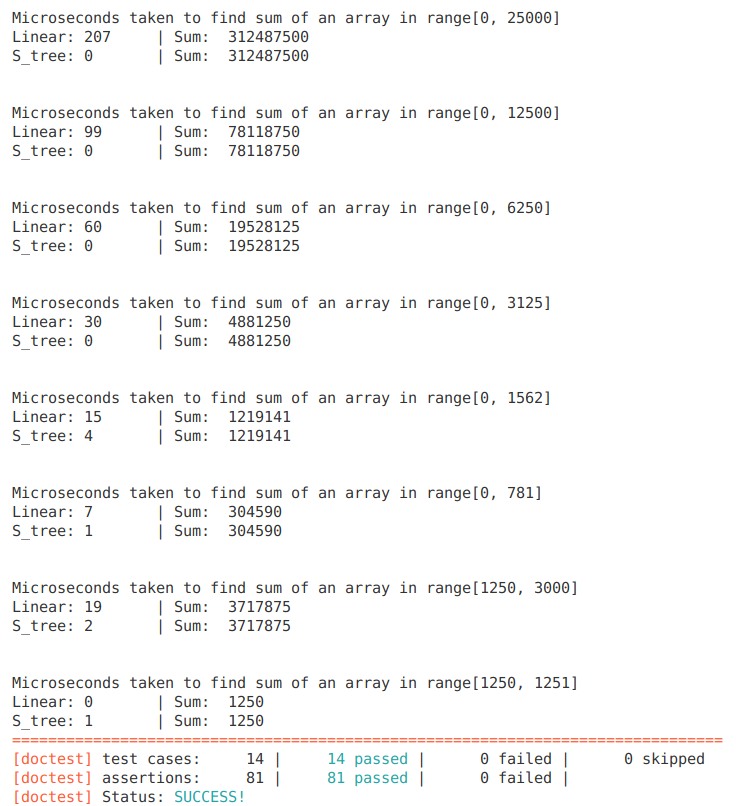

# Generic-Implementation-of-Segment-Trees-in-Cpp
A segment tree is a data structure that has primarily the following features.
1.  It allows answering range queries over an sequence of elements effectively. Some applications are ~
    *  Finding the sum of consecutive array elements in O(log n) time.
    *  Finding the minimum element of a sequence in O(log n) time.
2.   It is flexible enough to allow modifying the elements of the sequence.

Segment trees can be generalized to larger dimensions. 2D segment trees can be used for answering sum or min queries over a sub-section of a matrix in O(log<sup>2</sup>n) time.

My notes on segment trees can be found [here](https://docs.google.com/document/d/e/2PACX-1vS-ScTjtsW0UN2GmZnL8J_GBJdi4U3_7I6Gb5MRbbzNblQ-9QHwYFCLs6n95obU_zSdZBqL__4Pt4qE/pub).

___

### Simple Segment Tree

While   more   complex   implementations   of   a   segment tree  do  exist,  the scope of this  project is limited to  implementing  a  simple  segment  tree  with  the  following functionalities:

Given an sequence a[0. . .  n -1]
1.  find the sum of elements between indices l and r in O(log n) time.
2.  handle  changing  values  of  the  elements  of  the  array in O(log n) time.


#### Implementation
*  Main implementation of the segment tree is in segment_tree/segment_tree.h
*  Tests for each functionailty is in testing/segment_tree_tests.cpp . This file also contains the runtime comparision tests of segment trees vs linear data structures for computing range based sum queries. 
*  An example problem on sum queries for daily transactions is in testing/sample_problem.cpp

Comparison of the time taken to compute ranged sum queries on an array of size 100000, with element values 1 to 100000, using a segment tree and a linear data structure was done.



___

#### Segment Tree Functions

1. sum - returns the sum of elements between indices l and r in O(log n) time.
```cpp
/**
 *  @brief	Finds sum of consecutive elements in a range [queryLeft,queryRight).
 *  @param	queryLeft	Left index of range for which sum has to be found.
 *  @param	queryRight	Right index of range (Non-inclusive) for which sum has to be found.
 *  @return	Sum of range of consecutive elements from [queryLeft, queryRight)
 *
 *  Takes O(logN) time.
 */
T sum(int queryLeft, int queryRight);
```

2. update - handle changing values of the elements of the array in O(log n) time.
```cpp
/**
 *  @brief 	Modify a specific element in the tree.
 *  @param  index	Index of element to be updated.
 *  @param  newVal	New value of the element.
 * 
 *  Takes O(logN) time.
 */
void update(int index, T newVal);
```

####  Iterators Supported
This implementation supports bidirectional iterators.

1.  begin() -   Returns an iterator referring to the first element in the container.
2.  end()   -   Returns an iterator referring to the first element in the container.
3.  rbegin() -  Returns a reverse iterator referring to the last element in the container.
4.  rend() -    Returns a reverse iterator referring to one past the first element in the container.

####  Operations
1.  find -  Get iterator to element (public member function)
```cpp
/**
 *  @brief	Finds the first element that matches val.
 *  @param	val  Element to located.
 *  @return	Iterator to an element with val equivalent to val.
 *	If no such element is found, past-the-end iterator is returned.
 */
iterator find(const T val);
```
  
2.  count -  Count elements with a specific value (public member function)
```cpp
/**
 *  @brief	Finds the number of elements.
 *  @param	val	Element to located.
 *  @return	Number of elements with specified val.
 */
int count(const T &val);
```
3.  lower_bound - Return iterator to lower bound (public member function)
```cpp
/**
 *  @brief	Finds the beginning of a subsequence matching given val.
 *  @param	val	Element to be located.
 *  @return	Iterator pointing to first element equal to or greater than val, or end().
 */
iterator lower_bound(const T &val);

```
4.  upper_bound - Return iterator to upper bound (public member function)
```cpp
/**
 *  @brief	Finds the end of a subsequence matching given val.
 *  @param	val	Element to be located.
 *  @return	Iterator pointing to the first element greater than val, or end().
 */
iterator upper_bound(const T &val);

```
5.  equal_range - Get range of equal elements (public member function)
```cpp
/**
 *  @brief	Returns an iterator that points one past the last element in the container. 
 *  @param	val	Element to be located.
 *  @return	Iterator pointing to the first element greater than key, or end().
 *
 *	This is equivalent to make_pair(c.lower_bound(val), c.upper_bound(val))
 */
std::pair<iterator, iterator> equal_range(const T &val);
```

